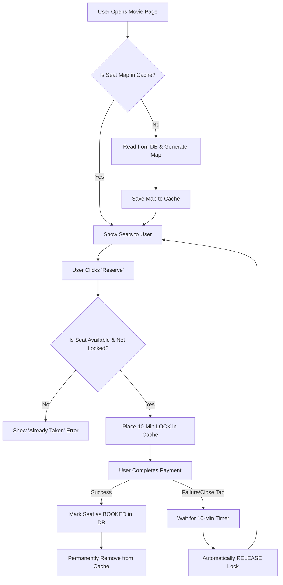

# 🎟️ Movie Booking: Caching & Seat Management Guide

This guide explains how our application handles hundreds of people trying to book the same seats at the exact same time without crashing the database.

## 1. The "Clipboard" Analogy

We use **Caching (Redis)** as a "Quick-Check Clipboard".

| Feature        | Database (Main Ledger)      | Cache (Quick Clipboard)     |
| :------------- | :-------------------------- | :-------------------------- |
| **Speed**      | 🐢 Slower (Disk)            | ⚡ Super Fast (RAM)         |
| **Purpose**    | Permanent Record (Bookings) | Temporary State (Seat Maps) |
| **Durability** | Saved forever               | Disappears after a timeout  |

---

## 2. The Seat Lifecycle (Visual Flow)

---

## 3. Why we use Cache Keys?

Every piece of data in the cache has a unique "Key" (like a label on a folder).

| Cache Key                 | What's inside?                     | Why?                               |
| :------------------------ | :--------------------------------- | :--------------------------------- |
| `seat_layout_123`         | The full grid (A1, A2, etc.)       | To draw the theater on the screen. |
| `available_seats_123`     | List of free seat IDs              | To show what's actually clickable. |
| `reserved_seats_123`      | List of seats held by users paying | To prevent "Double Booking".       |
| `seat_reservation_123_45` | Time + User info                   | To remember WHO locked WHAT.       |

---

## 4. Preventing "Double Bookings"

When `reserve_seats()` is called:

1. It checks the `reserved_seats` list.
2. If seat `A1` is in there, it rejects the new user instantly.
3. This is much faster than checking the database, making the experience smooth for everyone.
